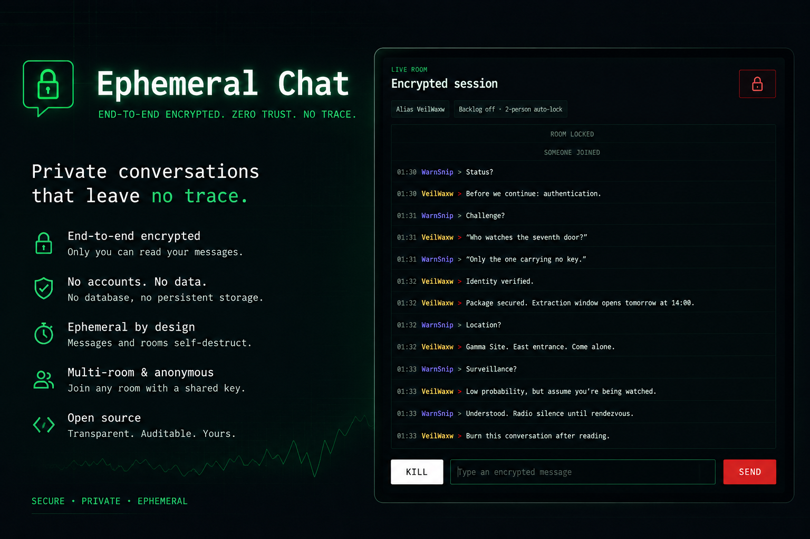

# Ephemeral Chat

<p align="center">
  
  
  
  
  
  
  
  
  
  
  
  
  
</p>ß

Ephemeral Chat is a small end-to-end encrypted web chat for short-lived conversations. It runs as a single Node.js process, keeps room state only in memory, and never stores plaintext messages or shared keys on the server.

Users join by entering the same shared key. The browser derives both the room ID and the encryption key locally, opens a same-origin WebSocket connection to `/ws`, then sends a `join` frame with the derived `roomId` and any requested room settings. In stateless multi-room mode, the server treats `roomId` as the transport-level room selector and does not verify knowledge of the original shared key. When the last participant leaves and the idle grace period expires, the room is removed from RAM.



## Current Functionality

- end-to-end encrypted text messaging in the browser
- no accounts, no database, no persistent history
- multi-room mode derived from the shared key
- optional single-room mode for one predefined shared key
- optional per-room join settings chosen by the first participant
- optional encrypted backlog replay for later joiners
- optional message self-destruct and room self-destruct timers
- room auto-lock after the second participant joins
- presence and system events for joins, leaves, locks, and expiry
- optimistic sending UI with retry, reconnect, and undeliverable states
- unread banner for live unread messages
- same-origin WebSocket admission policy, payload limits, heartbeat, and rate limiting

## How It Works

### Join Flow

1. A user opens the app and enters a shared key.
2. The browser derives the `roomId` and encryption key locally.
3. The client opens a same-origin WebSocket connection to `/ws`.
4. After the socket opens, the client sends a `join` frame with the derived `roomId` and any requested room settings.
5. The server validates origin during the HTTP upgrade, then validates the `join` payload before joining the room.
6. The client receives a `room-state` event first and a `backlog` event second.
7. Live messages, presence updates, and system events then stream over the same WebSocket.

### Encryption

The browser uses the Web Crypto API:

- `roomId = SHA-256("ephemeralchat-room-v1:" + sharedKey)`
- the encryption key is derived with `PBKDF2` + `SHA-256`
- messages are encrypted with `AES-GCM`
- each message gets a fresh 12-byte IV

The server sees only transport metadata and ciphertext:

- `roomId`
- `iv`
- `ciphertext`
- `clientMessageId`
- server-generated metadata such as `id`, `seq`, `sentAt`, and `expiresAt`

The server never sees:

- the shared key
- the derived encryption key
- plaintext message contents

## Security Model

Ephemeral Chat provides end-to-end encryption for message contents, but in stateless multi-room mode it does not provide server-side proof that a joining client knows the original shared key.

Security properties:

- the shared key protects message confidentiality
- the browser derives the encryption key locally and plaintext stays client-side
- the server stores only in-memory room state and encrypted message payloads
- same-origin WebSocket policy, join deadlines, payload validation, heartbeat, and rate limiting reduce transport abuse

Non-properties in stateless multi-room mode:

- the server does not authenticate room membership based on the shared key
- the server does not distinguish "knows the shared key" from "knows the derived roomId"
- room membership is not cryptographically hidden from parties that know the `roomId`
- room-level control actions are not cryptographically authorized by the shared key alone

### `roomId` As A Capability

In multi-room mode, `roomId` should be treated as a bearer capability for transport-level access to a room. Anyone who learns the `roomId` can attempt to join that room over WebSocket even if they do not know the original shared key.

Knowing only the `roomId` does not reveal plaintext messages, but it can still expose or enable:

- room existence
- timing and traffic patterns
- encrypted backlog visibility when backlog is enabled
- lifecycle events such as joins, leaves, locks, and expiry
- room-level actions that are authorized only by successful room join

Because of this, `roomId` should be handled as sensitive data:

- do not treat it as a harmless public identifier
- avoid putting it in URLs, analytics, crash reports, or debug output
- avoid logging it in server logs, client logs, or proxy access logs when possible

## Threat Model

This section describes the intended threat model for the default stateless multi-room deployment.

### Risk Analysis For `roomId` Exposure

If an attacker learns a valid `roomId`, they should be treated as having transport-level access to that room lifecycle even if they do not know the original shared key.

What an attacker with only `roomId` can do:

- attempt to join the room over WebSocket as another participant
- receive future encrypted chat payloads and encrypted backlog replay if backlog is enabled
- observe room lifecycle events such as joins, leaves, locks, expiry, and room destruction
- trigger room-level actions that are currently authorized by successful join rather than proof of shared-key knowledge
- record ciphertext, timing, and traffic volume for later analysis

What an attacker with only `roomId` still should not learn directly:

- plaintext message contents
- plaintext usernames carried inside encrypted chat payloads
- the original shared key
- the derived browser encryption key

What can still be inferred from metadata:

- whether a room is active at all
- when participants arrive, leave, or reconnect
- whether a room appears to be one-to-one or more active over time
- whether backlog, room locking, expiry, or room destruction events occurred
- rough conversation intensity from message timing, burstiness, and ciphertext counts

What this means operationally:

- a leaked `roomId` is enough to lose membership secrecy for that room lifecycle
- a leaked `roomId` is not by itself enough to decrypt historical or live message contents without the shared key
- a leaked `roomId` is enough for an attacker to issue room-level actions such as room lock or room destroy because those actions are currently authorized by successful join
- the ability to lock or destroy a room after learning `roomId` is a conscious design tradeoff of this stateless architecture, not an undocumented exception to the model
- strong shared keys still matter because they protect message confidentiality even when transport-level room membership is lost

User and operator guidance:

- share the original shared key only over an out-of-band channel appropriate for the sensitivity of the conversation
- avoid exposing `roomId` in URLs, analytics, logs, support dumps, screenshots, or copied debug output
- assume anyone who learns `roomId` can observe room activity timing and disrupt the room even if they cannot read its plaintext
- prefer short-lived rooms and rotate to a new shared key when disruption or leakage is suspected

### Defended Against

- passive observers who can see ciphertext but do not know the shared key
- accidental server-side plaintext disclosure through normal application behavior
- server compromise limited to in-memory room metadata and encrypted payloads, but not client-side secrets already cleared from the browser
- basic transport abuse mitigated by same-origin policy, admission limits, deadlines, and rate limiting

### Not Fully Defended Against

- anyone who learns a valid `roomId` and uses it as a bearer token for room membership
- metadata disclosure such as room existence, participant timing, presence, and message volume
- malicious room participants who know the shared key and can read or inject valid encrypted content
- destructive or administrative room actions triggered by a participant who joined using only the `roomId`
- endpoint compromise in the browser, including malicious extensions, local malware, or compromised client devices

### Deployment Assumptions

- TLS is required in production so `roomId`, ciphertext, and room metadata are not exposed in transit
- operators should avoid logging sensitive WebSocket payloads and should review reverse proxy logging defaults
- users must share the shared key out of band using a channel appropriate for the sensitivity of the conversation
- users should treat both the shared key and the derived `roomId` as secrets for the lifetime of the room

### Design Tradeoff

The default architecture intentionally chooses stateless multi-room operation over strong server-side membership verification. That keeps the service simple and avoids server-side secret storage, but it means membership privacy is weaker than message confidentiality. In practical terms, if an attacker learns `roomId`, they can join at the transport layer and can also trigger room-level actions such as lock or destroy because the server is intentionally not in a position to verify knowledge of the original shared key before applying those actions.

This architecture is chosen for a reason:

- the server never needs the shared key or a server-side verifier derived from it
- the server can remain a simple relay for ciphertext plus minimal room metadata
- deployment stays lightweight because there are no accounts, no persistent credential store, and no key-verification database
- message confidentiality remains end-to-end even if server memory or logs are later inspected, as long as the shared key itself does not leak

The price of those properties is that `roomId` acts as a bearer capability for room membership and room-level disruption. If your use case requires the server to verify knowledge of the shared key before join or before destructive actions, this architecture needs an additional authorization layer or a different room admission model.

## Room Behavior

### Multi-Room Mode

This is the default mode. Every shared key maps to a different room.

### Single-Room Mode

If you want to allow only one predefined room:

```env
SINGLE_ROOM_MODE=true
SINGLE_ROOM_KEY=your-shared-key
```

At startup, the server derives the one allowed `roomId` and rejects joins to any other room.

### First-Join Room Settings

The first participant in a room can define room policy for that room lifecycle:

- `maxPeople`
- `allowBacklog`
- `maxBacklogMessages`
- `lockRoomAfterSecondJoin`
- `messageSelfDestructMs`
- `roomSelfDestructMs`

Later joiners cannot override those settings. They receive the effective policy back in the `room-state` payload.

If `lockRoomAfterSecondJoin=true`, the room is capped at two people and becomes closed to any future rejoin attempts once the second participant has entered.

### Backlog and Expiry

- backlog stores encrypted messages only
- backlog replay is optional and disabled by default
- when backlog is enabled, retention is FIFO and capped
- message self-destruct removes the message from the server backlog and from connected clients
- room self-destruct expires the whole room on a fixed timer from room creation
- empty rooms without a room self-destruct timer are still removed after `ROOM_IDLE_GRACE_MS`

## Client Experience

After a successful join:

- the join form is replaced by the chat view
- the composer is enabled after the connection is established
- the current room settings summary is shown when relevant
- a live room-expiry countdown is shown when the room has an expiry time
- encrypted backlog messages are decrypted locally in the browser

While chatting:

- messages are shown optimistically before the server confirms them
- failed sends can be retried
- final server-side failures become `undeliverable`
- unread messages are counted only for live chat messages from other participants while the user is away from the bottom of the timeline

If the connection drops after a successful join, the client disables the composer, marks in-flight messages as failed, and attempts to reconnect automatically unless the server returned a final room error.

## Transport and Security

- the server accepts WebSocket upgrades only on the same origin
- idle WebSocket connections must send a valid `join` frame before `JOIN_DEADLINE_MS` expires
- pre-join sockets are capped globally and excess upgrades are rejected before the WebSocket handshake completes
- upgrade bursts are rate limited per client IP when the server can resolve the client IP safely
- invalid JSON, invalid transport envelopes, and binary frames are rejected
- per-socket sliding-window rate limiting is enforced
- WebSocket heartbeat pings terminate stale connections
- CSP, `X-Frame-Options`, `X-Content-Type-Options`, `Referrer-Policy`, and `Permissions-Policy` headers are set on HTTP responses
- the app is intentionally single-process because room state lives in memory

## Protocol Reference

The protocol is a JSON-over-WebSocket protocol on `GET /ws`.

### Handshake

The browser connects to:

```text
ws(s)://<host>/ws
```

After the socket opens, the client sends a `join` frame:

```json
{
  "type": "join",
  "roomId": "64-char-lowercase-hex",
  "roomSettings": {
    "maxPeople": 2,
    "allowBacklog": true,
    "maxBacklogMessages": 5,
    "lockRoomAfterSecondJoin": true,
    "messageSelfDestructMs": 1000,
    "roomSelfDestructMs": 2000
  }
}
```

Fields:

- `type`: literal `"join"`
- `roomId`: required 64-character lowercase hex room ID
- `roomSettings`: optional object, honored only when creating a new room lifecycle

Admission rules:

- request must be same-origin
- request path must resolve to pathname `/ws`
- the server may reject the HTTP upgrade with `429` or `503` before opening a WebSocket when pre-join protection triggers
- `join.roomId` must match `/^[a-f0-9]{64}$/`
- `join.roomSettings` must pass bounds validation
- in single-room mode, `join.roomId` must equal the configured allowed room ID

If admission succeeds, the server responds with WebSocket `101 Switching Protocols`.

### Frame Encoding

- all application frames are JSON text frames
- binary frames are rejected with close code `1003`
- invalid JSON is rejected with close code `1003`
- invalid transport envelopes are rejected with close code `1008`
- rate-limit violations are rejected with close code `1008`

### Client To Server Messages

#### `join`

Used immediately after the socket opens to select a room and optionally request initial room settings.

```json
{
  "type": "join",
  "roomId": "64-char-lowercase-hex",
  "roomSettings": {
    "maxPeople": 2,
    "allowBacklog": true,
    "maxBacklogMessages": 5,
    "lockRoomAfterSecondJoin": true,
    "messageSelfDestructMs": 1000,
    "roomSelfDestructMs": 2000
  }
}
```

Behavior:

- the first valid client frame must be `join`
- repeated `join` frames on the same socket are rejected
- if `roomSettings` are omitted, server defaults apply when creating a new room
- later joiners cannot override settings of an already-existing room lifecycle

#### `message`

Used to send an encrypted chat message.

```json
{
  "type": "message",
  "clientMessageId": "client-uuid-or-other-non-empty-string",
  "iv": "base64",
  "ciphertext": "base64"
}
```

Fields:

- `type`: literal `"message"`
- `clientMessageId`: non-empty string used for idempotent resend detection within one room lifecycle
- `iv`: non-empty string
- `ciphertext`: non-empty string

Behavior:

- if the same `clientMessageId` is seen again in the same room lifecycle, the server echoes the already-stored message instead of creating a new one
- the server assigns `id`, `seq`, `sentAt`, and optionally `expiresAt`

#### `set-room-lock`

Used by joined participants to manually lock or unlock the current room when `lockRoomAfterSecondJoin` is not enabled.

```json
{
  "type": "set-room-lock",
  "locked": true
}
```

Behavior:

- ignored when the room policy uses `lockRoomAfterSecondJoin`
- ignored when the requested lock state already matches the current room state
- otherwise broadcasts updated `room-state` plus a `system-event` of `Room locked` or `Room unlocked`

#### `kill-room`

Used by any joined participant to destroy the current room lifecycle immediately.

```json
{
  "type": "kill-room"
}
```

Behavior:

- the server broadcasts a final `error` with `reasonCode: "room_destroyed"`
- all connected room participants are closed
- the active room lifecycle is destroyed, and a later join creates a fresh lifecycle

### Server To Client Messages

The server can emit the following message types.

#### `room-state`

Always sent before `backlog` when a client joins successfully. Also broadcast later when room lock state changes.

```json
{
  "type": "room-state",
  "roomInstanceId": "uuid",
  "settings": {
    "maxPeople": 2,
    "allowBacklog": true,
    "maxBacklogMessages": 5,
    "lockRoomAfterSecondJoin": true,
    "messageSelfDestructMs": 1000,
    "roomSelfDestructMs": 2000
  },
  "runtime": {
    "locked": false,
    "roomExpiresAt": 1730000000000
  }
}
```

Fields:

- `roomInstanceId`: unique ID for the current room lifecycle
- `settings.maxPeople`: integer
- `settings.allowBacklog`: boolean
- `settings.maxBacklogMessages`: integer or `null`
- `settings.lockRoomAfterSecondJoin`: boolean
- `settings.messageSelfDestructMs`: integer or `null`
- `settings.roomSelfDestructMs`: integer or `null`
- `runtime.locked`: boolean
- `runtime.roomExpiresAt`: unix epoch milliseconds or `null`

#### `backlog`

Sent immediately after `room-state`.

```json
{
  "type": "backlog",
  "messages": []
}
```

Fields:

- `messages`: array of `message` payloads in server backlog form

#### `message`

Broadcast for newly accepted chat messages and reused inside `backlog.messages`.

```json
{
  "type": "message",
  "id": "server-message-id",
  "roomInstanceId": "uuid",
  "seq": 1,
  "iv": "base64",
  "ciphertext": "base64",
  "clientMessageId": "client-message-id",
  "expiresAt": 1730000000000,
  "sentAt": 1730000000000
}
```

Fields:

- `id`: server-generated message ID
- `roomInstanceId`: room lifecycle ID
- `seq`: monotonically increasing room-local sequence number
- `iv`: encrypted payload IV
- `ciphertext`: encrypted payload body
- `clientMessageId`: original client message ID
- `expiresAt`: unix epoch milliseconds or `null`
- `sentAt`: unix epoch milliseconds

Notes:

- plaintext author/message body is never present here; the client decrypts `iv` + `ciphertext` locally

#### `presence`

Broadcast on join and leave transitions, and when a room auto-locks because the second participant joins.

```json
{
  "type": "presence",
  "roomInstanceId": "uuid"
}
```

Fields:

- `roomInstanceId`: room lifecycle ID

#### `system-event`

Broadcast for room lifecycle events.

```json
{
  "type": "system-event",
  "roomInstanceId": "uuid",
  "text": "Someone joined",
  "sentAt": 1730000000000
}
```

Observed `text` values in the current implementation:

- `Someone joined`
- `Someone left`
- `Room locked`
- `Room unlocked`
- `Room expired`

#### `message-removed`

Broadcast when a self-destructing message expires.

```json
{
  "type": "message-removed",
  "roomInstanceId": "uuid",
  "messageId": "server-message-id",
  "reason": "self_destruct"
}
```

#### `error`

Broadcast before the server closes room connections for terminal room-level failures such as room expiry.

```json
{
  "type": "error",
  "roomInstanceId": "uuid",
  "reasonCode": "room_expired",
  "retryability": "final",
  "message": "Room expired."
}
```

Fields:

- `roomInstanceId`: room lifecycle ID
- `reasonCode`: machine-readable error code
- `retryability`: `"final"` or `"retryable"`
- `message`: human-readable error

### Ordering Guarantees

- after successful join, `room-state` is sent before `backlog`
- if a room becomes locked because the second participant joined, existing participants receive updated `room-state` before the corresponding `presence` broadcast
- room events are scoped by `roomInstanceId`, so clients can ignore stale frames from older room lifecycles

## Local Development

### Requirements

- Node.js 24+
- npm

### Development Mode

```bash
npm install
npm run dev
```

By default, the app runs at [http://127.0.0.1:3000](http://127.0.0.1:3000).

### Development With Caddy

If you want to test the app locally behind HTTPS, or expose it on your LAN while keeping HTTPS enabled, you can run the Node app first and then start Caddy with the checked-in [Caddyfile](Caddyfile):

```bash
npm run dev
caddy run --config Caddyfile
```

Current local example from [Caddyfile](Caddyfile):

```caddy
https://192.168.44.5 {
  tls internal
  reverse_proxy 127.0.0.1:3099
}
```

Notes:

- replace `192.168.44.5` with your machine's current LAN IP or another hostname you use locally
- the checked-in example proxies to `127.0.0.1:3099`, so either start the app on that port with `PORT=3099 npm run dev` or change the proxy target to `127.0.0.1:3000`
- if another device on your LAN opens the HTTPS URL, that device must trust Caddy's local root CA or the browser will show a certificate warning

Why use Caddy here:

- Caddy serves local and internal hosts over HTTPS automatically and can generate locally trusted certificates for them
- browsers treat `localhost` and `127.0.0.1` as potentially trustworthy for local development, but non-local resources must be served over `https://` to be considered secure
- many Web APIs and browser features are available only in a secure context, so HTTPS is useful when you are testing on a LAN address instead of only on `localhost`

Relevant references:

- Caddy automatic HTTPS and local HTTPS: [Automatic HTTPS](https://caddyserver.com/docs/automatic-https)
- MDN secure contexts: [Secure contexts](https://developer.mozilla.org/en-US/docs/Web/Security/Secure_Contexts)

### Production Build

```bash
npm install
npm run build
npm start
```

Health check:

```bash
curl http://127.0.0.1:3000/health
```

## Tests

```bash
npm test
```

The current test suite covers:

- app shell rendering, `/health`, and baseline security headers
- strict config parsing and config summary redaction
- room lifecycle, backlog retention, message removal, and expiry behavior
- transport admission policy, invalid payload handling, and rate limiting
- browser/server protocol compatibility for encrypted messages
- room settings propagation and first-join policy authority
- optimistic delivery reconciliation and unread state helpers
- WebSocket heartbeat behavior

## Configuration

Configuration is resolved in this order:

1. CLI flag, for example `--port=4000`
2. environment variable
3. `.env`
4. default value

Basic setup:

```bash
cp .env.example .env
```

### Environment Variables

- `APP_TITLE`: page title and UI branding, default `Ephemeral Chat`
- `HOST`: server bind address, default `0.0.0.0`
- `PORT`: HTTP port for both the web app and WebSocket server, default `3000`
- `TRUST_PROXY`: `true` or `false`, default `false`; enable only when the app sits behind a local trusted reverse proxy because degraded mode falls back to `request.socket.remoteAddress`
- `JOIN_DEADLINE_MS`: max time an upgraded socket may stay unjoined, default `5000`
- `ROOM_IDLE_GRACE_MS`: how long to keep an empty room in memory, default `60000`
- `DEFAULT_ALLOW_BACKLOG`: default backlog policy for newly created rooms, default `false`
- `MAX_BACKLOG_MESSAGES`: max retained backlog messages per room, default `100`
- `MAX_CLIENTS_PER_ROOM`: hard ceiling for room capacity, default `32`
- `MAX_ROOMS`: max in-memory room count, default `10000`
- `MAX_MESSAGE_SIZE_BYTES`: max incoming WebSocket payload size, default `16384`
- `MAX_OPEN_PREJOIN_SOCKETS`: max upgraded sockets waiting for `join`, default `250`
- `MAX_MESSAGE_SELF_DESTRUCT_MS`: upper bound for per-room message self-destruct, default `86400000`
- `MAX_ROOM_SELF_DESTRUCT_MS`: upper bound for per-room room self-destruct, default `604800000`
- `RATE_LIMIT_WINDOW_MS`: sliding-window duration for rate limiting, default `10000`
- `RATE_LIMIT_MAX_MESSAGES`: max client frames per rate-limit window, default `10`
- `UPGRADE_RATE_LIMIT_WINDOW_MS`: sliding-window duration for upgrade rate limiting, default `10000`
- `MAX_UPGRADES_PER_IP_PER_WINDOW`: max upgrade attempts per resolved client IP in one upgrade rate-limit window, default `20`
- `SINGLE_ROOM_MODE`: enables single-room mode, default `false`
- `SINGLE_ROOM_KEY`: required when `SINGLE_ROOM_MODE=true`

### CLI Flags

CLI flags mirror the environment variable names in kebab-case. Examples:

```bash
npm start -- --port=4000 --max-clients-per-room=8 --default-allow-backlog=true
```

`WS_PORT` is intentionally unsupported in the current single-origin server.

## Deployment

This project is designed for a single Node.js instance behind a reverse proxy.

### Recommended Setup

- run the Node process on an internal port such as `3000`
- place Nginx, Caddy, or a platform ingress in front of it
- forward normal HTTP traffic and WebSocket upgrades
- if `TRUST_PROXY=true`, keep the Node app behind a local trusted proxy hop
- use HTTPS if the app is reachable from the public internet

### Follow-up Ideas

- add `MAX_OPEN_PREJOIN_PER_IP` if real traffic shows one-IP socket hoarding after burst limiting
- replace the simple `TRUST_PROXY` boolean with a more explicit trusted-proxy policy if deployment topology grows
- expose degraded proxy mode on a separate operator status endpoint if logs are not enough

### Important Constraint

Run only one app instance unless you add shared room state. Clustered or horizontally scaled instances will split rooms across processes and break the current in-memory behavior.

### Example Deploy Flow

```bash
npm ci
npm run build
NODE_ENV=production npm start
```

### Running With Docker

Build and run only the app:

```bash
docker compose -f compose.yml up --build
```

The app will be available at [http://127.0.0.1:3000](http://127.0.0.1:3000).

Run the app behind Caddy over HTTP:

```bash
docker compose -f compose.yml -f compose.proxy.yml --profile http-proxy up --build
```

The proxy will listen at [http://127.0.0.1:8080](http://127.0.0.1:8080).

Run the app behind Caddy over HTTPS with Caddy's internal CA:

```bash
docker compose -f compose.yml -f compose.proxy.yml --profile https-proxy up --build
```

By default, the HTTPS proxy serves `https://localhost:8443`. You can override the hostname with `CADDY_HTTPS_HOST`, for example:

```bash
CADDY_HTTPS_HOST=ephemeral-chat.local docker compose -f compose.yml -f compose.proxy.yml --profile https-proxy up --build
```

Notes:

- `compose.yml` runs the app directly with `TRUST_PROXY=false`
- `compose.proxy.yml` flips the app to `TRUST_PROXY=true` and adds Caddy profiles
- the HTTPS profile persists Caddy state in named volumes so the internal CA and certificates survive restarts
- both proxy services wait for the app health endpoint before starting

### Running With PM2

This repository includes a PM2 config at [ecosystem.config.cjs](/Users/eddy/Work/Personal/ephemeral-chat/ecosystem.config.cjs).

```bash
npm install -g pm2
npm ci
npm run build
pm2 start ecosystem.config.cjs --env production
```

Useful PM2 commands:

```bash
pm2 status
pm2 logs ephemeral-chat
pm2 restart ecosystem.config.cjs
pm2 stop ecosystem.config.cjs
pm2 delete ecosystem.config.cjs
pm2 save
pm2 startup
```

## Disclaimer

This project was created for educational purposes, testing, and learning about end-to-end encrypted communication. It is provided as-is, without warranties or guarantees of any kind, and you use it entirely at your own risk.

You are solely responsible for how you use, deploy, modify, or share this software. It must always be used in compliance with the laws, regulations, and policies applicable in your country or jurisdiction.

This project is not intended to support, encourage, or facilitate illegal activity, unauthorized access, privacy violations, or harmful behavior of any kind. The author disclaims liability for misuse, damages, losses, legal consequences, or other claims arising from the use or inability to use this project.
